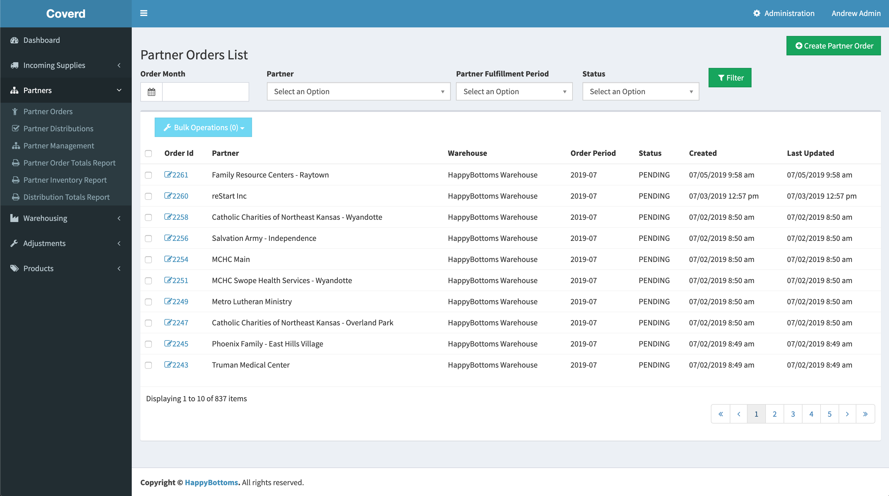

# Coverd Donation Bank Manager

Coverd is an open source Symfony/Vue.js web application that manages the inventory and distribution of donated goods in a `Bank -> Partner -> Client` model. While this app was developed for diaper banks, our intent is for Coverd to be product agnostic.

Coverd offers the following features.

- Product management
- Warehouse management
- Partner management
- Client management (planned)
- Warehouse and Partner Inventory
- Full inventory transaction history
- Partner login, ordering, and client management (planned)
- Custom Partner and Client fields (planned)
- Client (Recipient) record encryption (planned)
- Support for multiple warehouses
- Inventory transfers
- Partner Order workflow
- Order packing sheets
- Fine-grained permission levels

## Development Installation - Docker Compose

1. `./bin/dockerized-install.sh`
1. `./docker/up.sh`

You should now be able to connect to your the dev server at http://localhost:8080/

### Install just the PHP app with updated DB

1. `docker/app ./bin/php_install.sh`

### Install just the JS app

1. `docker/app ./bin/js_install.sh`

### Update After Switching to a New Branch

1. `docker/app ./bin/post-update.sh`

### Build and watch the Vue JS app

1. `docker/yarn watch`

### Debugging with Xdebug

1. In the "XDEBUG" section of `.env.local`, set `XDEBUG_MODE` to include `debug`
   - ex. `XDEBUG_MODE=develop,debug`
   - For more information, see: https://xdebug.org/docs/install#mode
1. Rebuild your environment: `docker/up.sh`
   - Note: If you are debugging via phpunit, you can do this more quickly via:
     1. `docker/app bash`
     1. `export XDEBUG_MODE=debug`
     1. Run your phpunit tests from this command-line
1. If using PHPStorm, make sure you set your xdebug server to have the name "coverd"
1. Don't forget to reset your `XDEBUG_MODE` when you are done debugging

## Work With the Dev Environment

We have fixtures to define basic users of certain roles:

- admin (sees everything):
  - **email:** admin@example.com
  - **password:** password
- manager:
  - **email:** manager@example.com
  - **password:** password
- volunteer:
  - **email:** volunteer@example.com
  - **password:** password

Most of the time in development, you will probably want to log in as the admin. when needing to check access for certain types of users, log in as the appropriate role-based user.

## Zip Code/County Information

Coverd has a zip code/county lookup field to capture the number of people served by county. This information has to be sourced from two government data files listed below.

- Zipcode -> County ID (FIPS) : https://www.huduser.gov/portal/datasets/usps_crosswalk.html
- County ID (FIPS) -> County Name: https://www.census.gov/geographies/reference-files/time-series/geo/gazetteer-files.html (see "Counties" file)

These files are located in /src/Data/ and are imported with the `app:zip-county:import` command.

## FontAwesome

Coverd makes use of the free set of icons from FontAwesome. To search the available icons, see https://fontawesome.com/icons?m=free.
